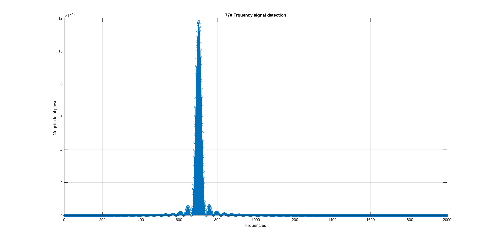
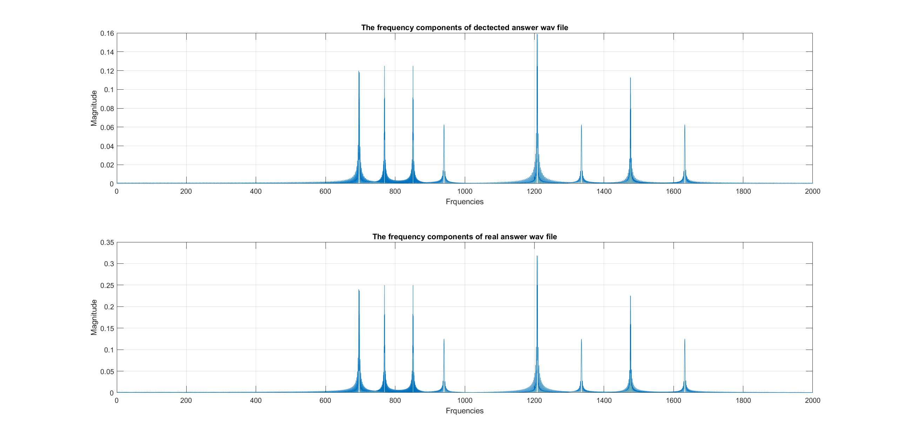

# Intro files

```
Create the workstation anywhere or in this git project.
Please use the "workstation" as the workstation name, therefore, it would automatically ignore.
Please use the code in the ./DSP_coursework/source_project
```

## DSP_cousrsework_group5

**GitHub repository**: https://github.com/alfredzhang98/DSP_lab.git

This is a public repository, so if you need me to make it private, please email me.

### group_5_audio

This includes the audio source files that got from TAs.

### source_project

This includes the coursework main source files: GTZ_all_freq_2022 and GTZ_One_freq

If you want to get **more debug info,** you can uncomment the "#define _DEBUG" in the util.c file.

And you can also use uncomment to enable other functions and optimisation strategies

<u>Functions:</u>

#define READ_BIN: Read bin files

#define READ_INPUT: read the input from the console

#define GENERATE_WAV: enable generate the wav file

#define WAY1/WAY2: there are two ways to get the result which write in different logic

<u>Optimisation strategies:</u>

#define COMPILER_IMPROVE： enable  #pragma XXX

#define MEMORY_IMPROVE： enable  _nassert

#define ORIGIN: The origin C code

#define INSTRUCTION_IMPROVE: The code use instruction

### validation_project

The C folder: is to test of the Goertzel algorithm

The Matlab folder: Plot the frequency response diagram, and double-check the wav results

The frequency response:



 Double-check the wav results



The Python folder: int to the fractional figure transfer function


